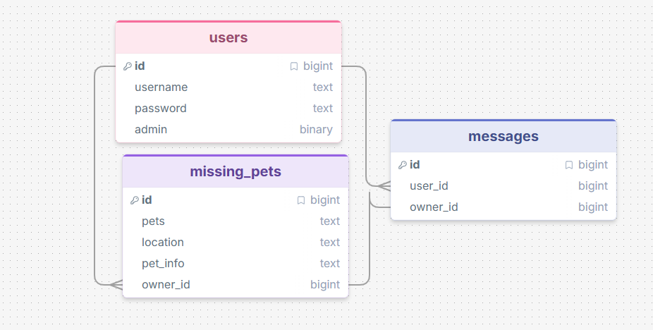

# Sprint 1 - Developing a DB and UI Prototype

## Sprint Goals

Develop a design for the database and a UI prototype that simulates the key functionality of the system. Test and refine the UI so that it can serve as the model for the next phase of development in Sprint 2.

### Specific Goals

**Edit these goals as needed**

- Design the database:
    - Tables
    - Fields / types
    - Primary keys
    - Default / nullable values
    - Relationships (foreign keys)
- Design the UI
    - Key pages
    - User interactions and 'flow'
    - Page layouts / features
    - Colour palette
    - Etc.

## Initial Database Design

### Required Data Input

users will be able to input a username and a password along with missing pet details.users can also send messages to users

### Required Data Output

my app will display missing pet reports, pet details, find pet reports, and user messages. Users can also view their own pet reports.

### Required Data Processing

my app stores user accounts, pet reports, and messages in a database. It checks login details, saves new reports, and searches pet records based on user input.

## UI 'Flow'

The first stage of prototyping was to explore how the UI might 'flow' between states, based on the required functionality.

This Figma demo shows the initial design for the UI 'flow':

https://design.penpot.app/#/view?file-id=f0485fb1-4e63-8165-8008-390913a71afb&page-id=f0485fb1-4e63-8165-8008-390913a71afc&section=interactions&frame-id=1cc6c8cb-c86a-8085-8008-39091a12d27f&index=0&share-id=4ff7ff5f-2875-80f9-8008-5a78ba967f34

### Testing
i got feedback from an end user to change or seee if any changes needed ot be done

### Changes / Improvements

added more text and more options so they know what they can do

https://design.penpot.app/#/view?file-id=2be68822-842f-8175-8008-663431c710e4&page-id=f0485fb1-4e63-8165-8008-390913a71afc&section=interactions&frame-id=1cc6c8cb-c86a-8085-8008-39091a12d27f&index=0&share-id=2be68822-842f-8175-8008-6634d2cf4aa8

## Initial UI Prototype

The next stage of prototyping was to develop the layout for each screen of the UI.

This Figma demo shows the initial layout design for the UI:

*FIGMA PROTOTYPE - PLACE THE FIGMA EMBED CODE HERE - MAKE SURE IT IS SET SO THAT EVERYONE CAN ACCESS IT*

### Testing

Replace this text with notes about what you did to test the UI flow and the outcome of the testing.

### Changes / Improvements

Replace this text with notes any improvements you made as a result of the testing.

*FIGMA IMPROVED PROTOTYPE - PLACE THE FIGMA EMBED CODE HERE - MAKE SURE IT IS SET SO THAT EVERYONE CAN ACCESS IT*

## Refined UI Prototype

Having established the layout of the UI screens, the prototype was refined visually, in terms of colour, fonts, etc.

This Figma demo shows the UI with refinements applied:

*FIGMA REFINED PROTOTYPE - PLACE THE FIGMA EMBED CODE HERE - MAKE SURE IT IS SET SO THAT EVERYONE CAN ACCESS IT*

### Testing

Replace this text with notes about what you did to test the UI flow and the outcome of the testing.

### Changes / Improvements

Replace this text with notes any improvements you made as a result of the testing.

*FIGMA IMPROVED REFINED PROTOTYPE - PLACE THE FIGMA EMBED CODE HERE - MAKE SURE IT IS SET SO THAT EVERYONE CAN ACCESS IT*

## Sprint Review

Replace this text with a statement about how the sprint has moved the project forward - key success point, any things that didn't go so well, etc.

